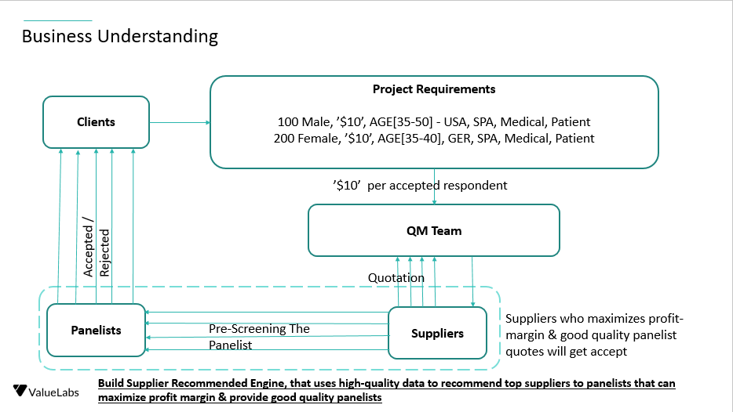
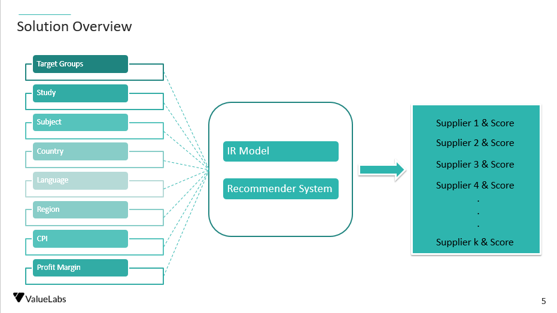
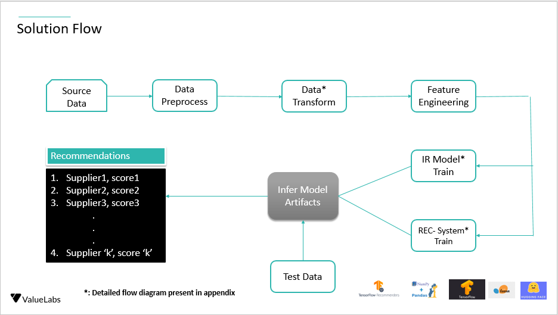

# supplier-recommendation-engine
A repository where we can store source code, artifacts, and other work/deliverables

<h1> Business Understanding - Analysis </h1>

<h1> Solution Flow :</h1>

<h1> Detailed Solution :</h1>

<h1> Install Dependencies :</h1>
<ol>python 3.8.0+</ol>
<ol>pip install -r requirements.txt</ol>

<h1> Data transformation :</h1>
python data_transformation.py

<h1> Training Guide :</h1>
python train.py

<h1> Inference Guide :</h1>
python infer.py
