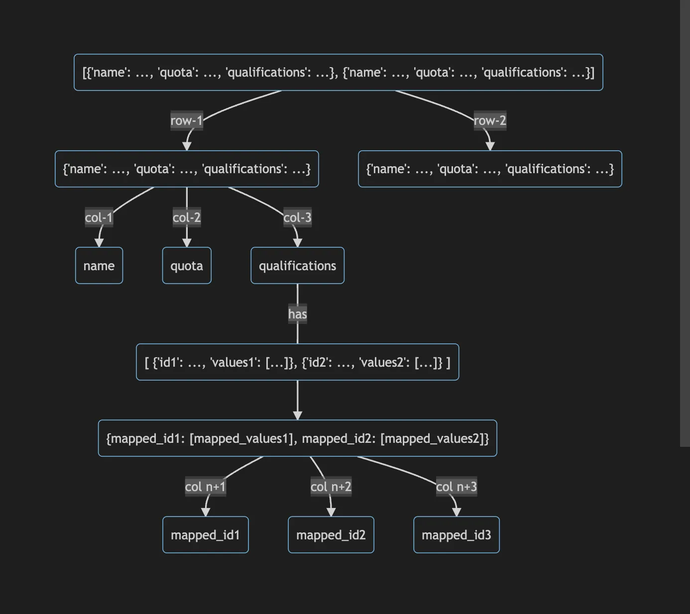

<h1> Information Retrieval</h1>
- This is the First Component of the Supplier Recommendation Engine.
 - The task of this component is to match the requirements of the QM project with the probable suppliers who might have supplied panelist in the past for the given combination of the requirement.
 - This is done so as to get the list of suppliers and pass it to the next component i.e. Recommender System.

<h2> Data Transformation :</h2>

- The above transformations are done on the source file i.e. Panelist-wise Disposition csv.
 

<h2> Model Flow </h2>

- There are Two IR models used as shown in the flow above.
 

<h2> Target Group Qualification Transformation </h2>

- Above is the depiction of how the Target Group Qualification column is transformed and flattened as it is unstructured and dynamic in nature.
 

<h2> Target Group Qualification Sample </h2>

 

<h2> IR Model Validation Sample Sheet </h2>

 

<h1> Training Guide :</h1>
python main.py

<h1> Inference Guide :</h1>
python inference.py
