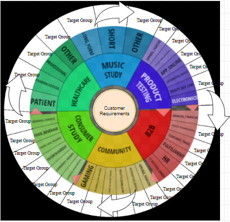
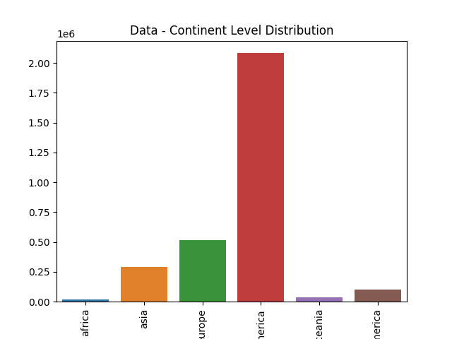
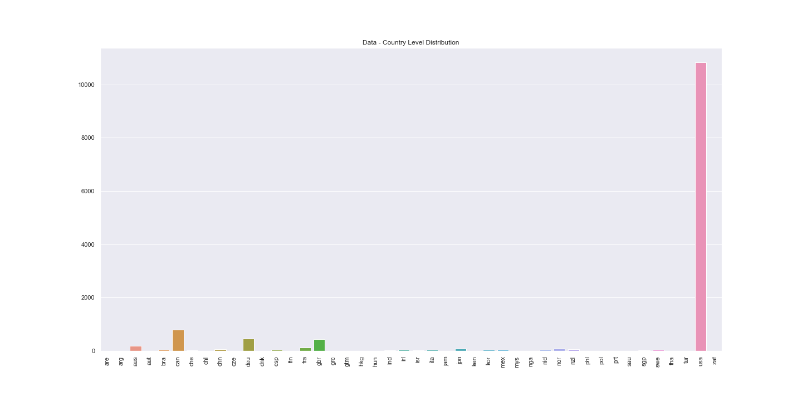
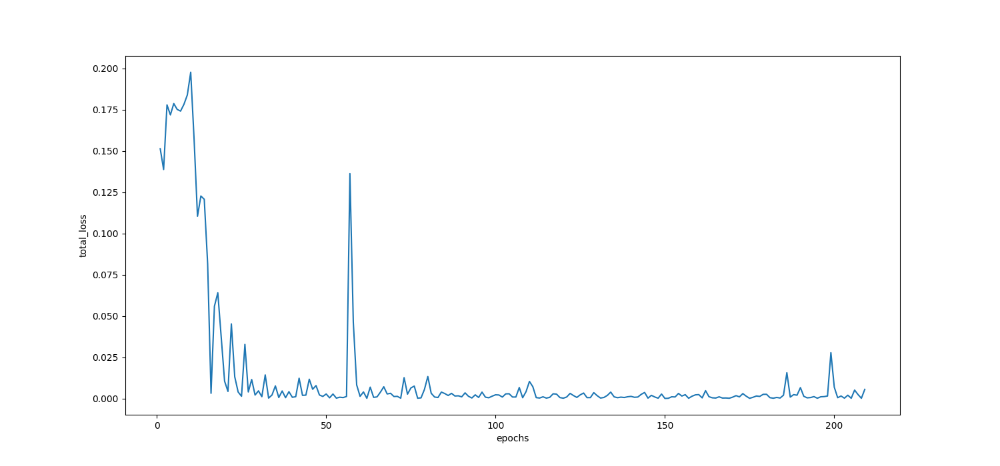
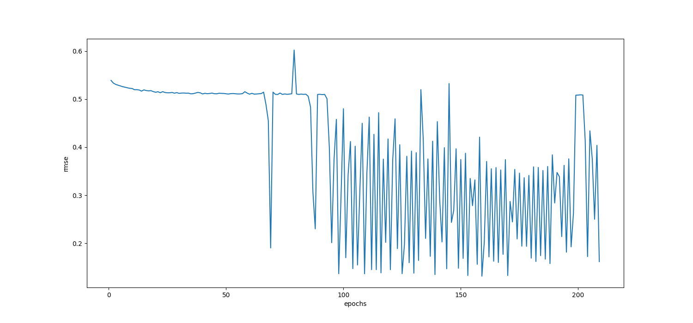
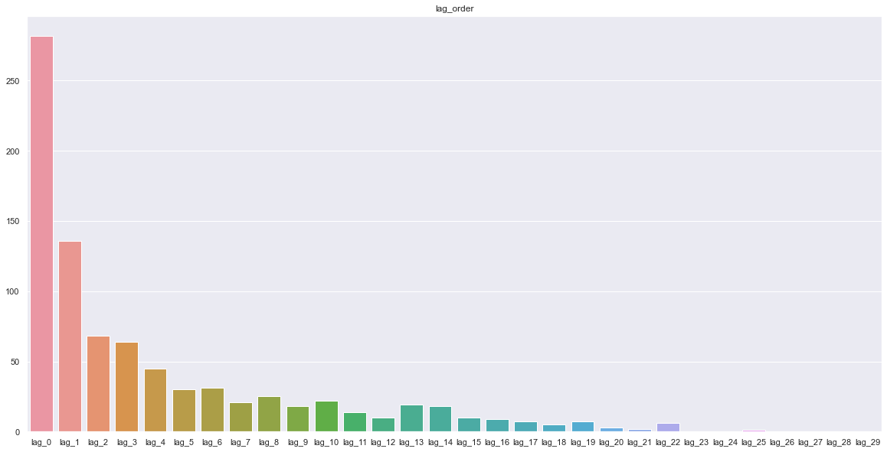

# supplier-recommendation-engine
A repository where we can store source code, artifacts, and other work/deliverables

<h1> Data - Analysis </h1>

<h2> Customer Requirements :</h2>

<h2> Continent Level Data Distribution :</h2>

<h2> Country Level Data Distribution :</h2>

<h1> Training Guide :</h1>
python main.py

<h1> Inference Guide :</h1>
python inference.py

<h1> Model Results </h1>
<h2> Model Loss </h2>

<h2> Model Score </h2>

<h1> Model Validation </h1>
<h2> Model Supplier Position </h2>

